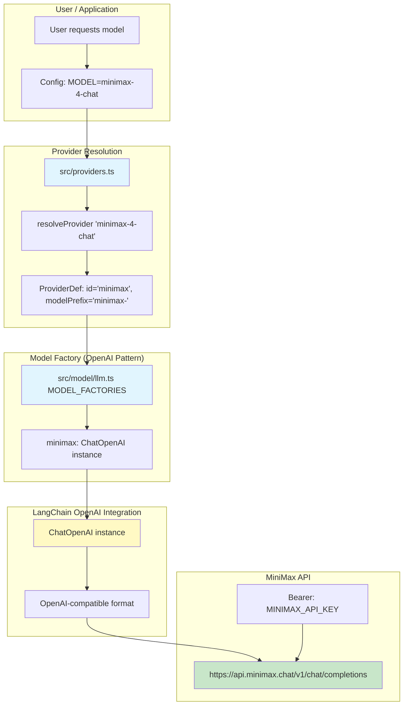
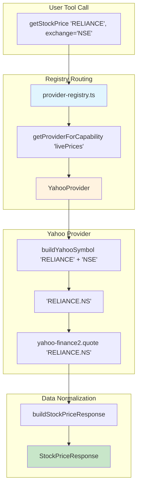

# Dexter Integration Planning Document
## MiniMax LLM + Yahoo Finance (Free Data Sources)

**Version:** 2.1 - OpenAI-Compatible API Pattern
**Created:** 2026-03-03
**Updated:** 2026-03-03
**Status:** Ready for Implementation
**Output Directory:** ~/Projects/dexter/docs/

---

## CRITICAL DESIGN DECISION: MiniMax Uses OpenAI-Compatible API

**IMPORTANT:** MiniMax provides an OpenAI-compatible API, NOT Anthropic!

- **API Endpoint:** https://api.minimax.chat/v1
- **API Format:** OpenAI-compatible (`/v1/chat/completions`)
- **Integration Pattern:** Follow the OpenAI provider pattern (NOT Anthropic)
- **LangChain Class:** Use `ChatOpenAI` (NOT `ChatAnthropic`)
- **Response Format:** Matches OpenAI structure

### Why OpenAI Pattern?

MiniMax's API is designed to be a drop-in replacement for OpenAI's API:

```
OpenAI Request Format → MiniMax Accepts ✓
OpenAI Response Format → MiniMax Returns ✓
LangChain ChatOpenAI → Works with MiniMax ✓
```

**DO NOT use Anthropic pattern:**
- ❌ Do NOT use `ChatAnthropic` class
- ❌ Do NOT use Anthropic-specific headers
- ❌ Do NOT use Anthropic message format
- ❌ Do NOT use `max_tokens_to_sample` parameter

**USE OpenAI pattern:**
- ✅ Use `ChatOpenAI` class
- ✅ Use OpenAI-compatible headers (`Authorization: Bearer <key>`)
- ✅ Use OpenAI message format (`messages: [{role, content}]`)
- ✅ Use OpenAI parameters (`max_tokens`, `temperature`, etc.)

---

## 1. Requirements Analysis

### 1.1 Core Objectives

| Objective | Description | Priority |
|-----------|-------------|----------|
| **MiniMax LLM Integration** | Add MiniMax M2.5 as a supported LLM provider in Dexter | High |
| **Yahoo Finance Enhancement** | Enhance existing Yahoo provider for better NSE/BSE support | High |
| **Provider Agnostic Design** | Follow existing patterns, no breaking changes | High |
| **Free Data Sources** | Use only free APIs (Yahoo Finance, no paid providers) | High |

### 1.2 Technical Constraints

- **LLM Model:** Must use MiniMax API key (already available)
- **Data Provider:** Must use Yahoo Finance (free, no auth required)
- **Architecture:** Must follow Dexter's existing provider patterns
- **No Breaking Changes:** Existing providers must continue working

### 1.3 Success Criteria

- [ ] MiniMax LLM can be used via model name prefix (e.g., `minimax-...`)
- [ ] Uses OpenAI-compatible API pattern (NOT Anthropic)
- [ ] Yahoo Finance works for NSE/BSE symbols without paid APIs
- [ ] All existing providers (OpenAI, Anthropic, etc.) continue to work
- [ ] Code follows DRY and KISS principles
- [ ] No regressions in existing functionality

---

## 2. Architecture Analysis

### 2.1 Current LLM Provider Pattern

Dexter uses a **registry-based factory pattern** for LLM providers:

```
src/providers.ts (Registry)
    └── PROVIDERS[] (Provider metadata)
    └── resolveProvider(modelName) → ProviderDef
    └── getProviderById(id) → ProviderDef

src/model/llm.ts (Factory)
    └── MODEL_FACTORIES[id] → ModelFactory
    └── getChatModel(modelName) → BaseChatModel
    └── callLlm(prompt, options) → LlmResult
```

**Key Design Decisions:**
- **Prefix-based routing:** `claude-` → Anthropic, `gemini-` → Google, `minimax-` → MiniMax
- **Factory pattern:** Each provider has a factory function
- **LangChain integration:** All providers implement LangChain's `BaseChatModel`
- **Unified interface:** `getChatModel()` works for all providers

### 2.2 MiniMax API Structure

**MiniMax follows OpenAI API structure exactly:**

```typescript
// MiniMax API Request (OpenAI-compatible)
POST https://api.minimax.chat/v1/chat/completions
Headers:
  Authorization: Bearer <MINIMAX_API_KEY>
  Content-Type: application/json

Body:
{
  "model": "minimax-4-chat",
  "messages": [
    {"role": "system", "content": "You are a helpful assistant."},
    {"role": "user", "content": "Hello!"}
  ],
  "temperature": 0.7,
  "max_tokens": 2048,
  "stream": false
}

// MiniMax API Response (OpenAI-compatible)
{
  "id": "chat-xxxxx",
  "object": "chat.completion",
  "created": 1234567890,
  "model": "minimax-4-chat",
  "choices": [
    {
      "index": 0,
      "message": {
        "role": "assistant",
        "content": "Hello! How can I help you today?"
      },
      "finish_reason": "stop"
    }
  ],
  "usage": {
    "prompt_tokens": 20,
    "completion_tokens": 10,
    "total_tokens": 30
  }
}
```

### 2.3 Finance Provider Pattern

Dexter uses an **abstract base class + registry pattern** for finance providers:

```
src/tools/finance/providers/
    ├── base-provider.ts (Abstract base class)
    ├── types.ts (Interfaces and schemas)
    ├── provider-registry.ts (Registry + routing)
    ├── yahoo-provider.ts (Yahoo implementation - EXISTS)
    ├── groww-provider.ts (Groww implementation - PAID)
    └── zerodha-provider.ts (Zerodha implementation - PAID)
```

**Key Design Decisions:**
- **BaseProvider:** Abstract class with common HTTP/error handling
- **Capabilities:** Each provider declares supported features
- **Registry:** Manages initialization, routing, and fallback
- **Provider agnostic:** Tools use registry, not direct provider calls

### 2.4 Yahoo Finance Integration Status

**Good news:** Yahoo provider **already exists** at `src/tools/finance/providers/yahoo-provider.ts`

**Current Implementation:**
- Uses `yahoo-finance2` npm package
- Supports: Live prices, Historical data
- Capabilities: `['US', 'IN', 'GLOBAL']`
- No API key required (free)

**What Needs Enhancement:**
- Better NSE/BSE symbol handling
- More robust error handling for Indian markets
- Documentation on how to use it

---

## 3. MiniMax LLM Implementation

### 3.1 Step 1: Add MiniMax to Provider Registry

**File:** `src/providers.ts`

**Add MiniMax entry to `PROVIDERS` array (after `deepseek`, before `openrouter`):**

```typescript
export const PROVIDERS: ProviderDef[] = [
  // ... existing providers ...
  {
    id: 'deepseek',
    displayName: 'DeepSeek',
    modelPrefix: 'deepseek-',
    apiKeyEnvVar: 'DEEPSEEK_API_KEY',
    fastModel: 'deepseek-chat',
  },
  
  // ===== MiniMax Provider =====
  // CRITICAL: MiniMax uses OpenAI-compatible API (NOT Anthropic)
  {
    id: 'minimax',
    displayName: 'MiniMax',
    modelPrefix: 'minimax-',
    apiKeyEnvVar: 'MINIMAX_API_KEY',
    fastModel: 'minimax-4-flash',
  },
  
  {
    id: 'openrouter',
    displayName: 'OpenRouter',
    modelPrefix: 'openrouter:',
    apiKeyEnvVar: 'OPENROUTER_API_KEY',
    fastModel: 'openrouter:openai/gpt-4o-mini',
  },
  
  // ... rest of providers ...
];
```

### 3.2 Step 2: Add MiniMax to Model Factory (OpenAI Pattern)

**File:** `src/model/llm.ts`

**Add MiniMax factory to `MODEL_FACTORIES` object (after `deepseek`, before `openrouter`):**

```typescript
const MODEL_FACTORIES: Record<string, ModelFactory> = {
  // ... existing factories ...
  
  deepseek: (name, opts) =>
    new ChatOpenAI({
      model: name,
      ...opts,
      apiKey: getApiKey('DEEPSEEK_API_KEY'),
      configuration: {
        baseURL: 'https://api.deepseek.com',
      },
    }),
  
  // ===== MiniMax Factory (OpenAI-Compatible Pattern) =====
  // CRITICAL: Use ChatOpenAI because MiniMax provides OpenAI-compatible API
  // DO NOT use ChatAnthropic or Anthropic-specific patterns
  minimax: (name, opts) =>
    new ChatOpenAI({
      model: name.replace(/^minimax:/, ''),
      ...opts,
      apiKey: getApiKey('MINIMAX_API_KEY'),
      configuration: {
        baseURL: 'https://api.minimax.chat/v1',  // OpenAI-compatible endpoint
      },
    }),
  
  openrouter: (name, opts) =>
    new ChatOpenAI({
      model: name.replace(/^openrouter:/, ''),
      ...opts,
      apiKey: getApiKey('OPENROUTER_API_KEY'),
      configuration: {
        baseURL: 'https://openrouter.ai/api/v1',
      },
    }),
  
  // ... rest of factories ...
};
```

**Key Points:**
- ✅ Uses `ChatOpenAI` class (OpenAI-compatible)
- ✅ Uses `baseURL: 'https://api.minimax.chat/v1'`
- ✅ Uses OpenAI parameter names (`model`, `messages`, `temperature`, etc.)
- ❌ Does NOT use `ChatAnthropic`
- ❌ Does NOT use Anthropic-specific parameters

### 3.3 Step 3: Add Environment Variable

**File:** `.env.example`

**Add these lines after the `Model Configuration` section:**

```bash
# ========================================
# MiniMax LLM Provider (OpenAI-Compatible API)
# ========================================
# Get your API key from: https://api.minimax.chat/
# MiniMax provides an OpenAI-compatible API at https://api.minimax.chat/v1
# Follows the same request/response format as OpenAI
# Used for: MiniMax M2.5 and other models
MINIMAX_API_KEY=your-minimax-api-key

# Optional: Custom base URL (default: https://api.minimax.chat/v1)
# MINIMAX_BASE_URL=https://api.minimax.chat/v1
```

### 3.4 Step 4: Usage Examples

**Example 1: Use MiniMax as default model**

```bash
# Set environment variable
export MODEL=minimax-4-chat

# Run Dexter
bun run start
```

**Example 2: Use MiniMax in code**

```typescript
import { getChatModel, callLlm } from '@/model/llm';

// Get MiniMax model instance
const minimaxModel = getChatModel('minimax-4-chat');

// Call MiniMax with prompt
const result = await callLlm('What is Apple stock price today?', {
  model: 'minimax-4-chat',
});

console.log(result.response);
```

**Example 3: Use MiniMax fast model for summarization**

```typescript
import { getFastModel, callLlm } from '@/model/llm';

const fastModel = getFastModel('minimax', 'minimax-4-chat');
// Returns: 'minimax-4-flash' (configured as fastModel)

const summary = await callLlm(longText, {
  model: fastModel,
});
```

---

## 4. Yahoo Finance Enhancement

**Note:** Yahoo provider already exists. The changes below are **enhancements only**.

### 4.1 Step 1: Enhance Symbol Normalization

**File:** `src/tools/finance/providers/yahoo-provider.ts`

**Add helper method to `YahooProvider` class:**

```typescript
/**
 * Build Yahoo Finance symbol with exchange suffix
 * Uses the exchange from context if provided
 * Yahoo Finance uses .NS suffix for NSE and .BO suffix for BSE
 */
private buildYahooSymbol(context: ProviderRequestContext): string {
  const symbol = this.validateTicker(context.ticker);
  
  if (context.exchange === 'NSE') {
    return \`\${symbol}.NS\`;
  } else if (context.exchange === 'BSE') {
    return \`\${symbol}.BO\`;
  }
  
  // If no exchange specified, try to detect
  // Most common case: if symbol doesn't have suffix, try .NS first
  if (!symbol.endsWith('.NS') && !symbol.endsWith('.BO')) {
    // Assume NSE for most Indian queries
    return \`\${symbol}.NS\`;
  }
  
  return symbol;
}
```

### 4.2 Step 2: Update `getStockPrice` Method

**File:** `src/tools/finance/providers/yahoo-provider.ts`

**Replace existing `getStockPrice` method:**

```typescript
/**
 * Get stock price
 */
async getStockPrice(context: ProviderRequestContext): Promise<StockPriceResponse> {
  // Build Yahoo Finance symbol with proper suffix
  const yahooSymbol = this.buildYahooSymbol(context);
  
  try {
    const quote = await yahooFinance.quote(yahooSymbol) as any;
    
    if (!quote || quote.regularMarketPrice === null) {
      // Try without suffix if first attempt failed
      if (yahooSymbol.endsWith('.NS')) {
        const altSymbol = yahooSymbol.replace('.NS', '');
        try {
          const altQuote = await yahooFinance.quote(altSymbol) as any;
          if (altQuote && altQuote.regularMarketPrice !== null) {
            return this.buildStockPriceResponse(altSymbol, altQuote);
          }
        } catch {
          // Fall through to error
        }
      }
      
      throw this.createError(
        \`Ticker \${context.ticker} not found\`,
        ProviderErrorCode.NOT_FOUND,
        false
      );
    }

    return this.buildStockPriceResponse(context.ticker, quote);
  } catch (error) {
    if (error instanceof Error && error.message.includes('Not Found')) {
      throw this.createError(
        \`Ticker \${context.ticker} not found\`,
        ProviderErrorCode.NOT_FOUND,
        false,
        undefined,
        error
      );
    }
    throw this.createError(
      error instanceof Error ? error.message : 'Failed to get quote',
      ProviderErrorCode.NETWORK_ERROR,
      true,
      undefined,
      error
    );
  }
}

/**
 * Build stock price response from Yahoo Finance quote
 */
private buildStockPriceResponse(originalTicker: string, quote: any): StockPriceResponse {
  const currency = this.getCurrencyFromCurrencyCode(quote.currency);
  const marketState = this.getMarketState(quote.marketState);
  
  return this.normalizeStockPrice(originalTicker, 'yahoo', {
    price: quote.regularMarketPrice,
    change: quote.regularMarketChange,
    changePercent: quote.regularMarketChangePercent,
    currency,
    marketState,
    volume: quote.regularMarketVolume,
    marketCap: quote.marketCap,
    sharesOutstanding: quote.sharesOutstanding,
    sourceUrl: \`https://finance.yahoo.com/quote/\${originalTicker}\`,
  });
}
```

### 4.3 Step 3: Update `getHistoricalData` Method

**File:** `src/tools/finance/providers/yahoo-provider.ts`

**Replace existing `getHistoricalData` method:**

```typescript
/**
 * Get historical data
 */
async getHistoricalData(context: ProviderRequestContext): Promise<HistoricalDataResponse> {
  const yahooSymbol = this.buildYahooSymbol(context);
  
  const startDate = context.startDate 
    ? new Date(context.startDate) 
    : new Date(Date.now() - 30 * 24 * 60 * 60 * 1000);
  const endDate = context.endDate 
    ? new Date(context.endDate) 
    : new Date();

  try {
    const history = (await yahooFinance.historical(yahooSymbol, {
      period1: startDate,
      period2: endDate,
      interval: '1d',
    })) as any;

    if (!history || history.length === 0) {
      // Try without suffix
      if (yahooSymbol.endsWith('.NS') || yahooSymbol.endsWith('.BO')) {
        const altSymbol = yahooSymbol.replace(/\.(NS|BO)$/, '');
        try {
          const altHistory = (await yahooFinance.historical(altSymbol, {
            period1: startDate,
            period2: endDate,
            interval: '1d',
          })) as any;
          
          if (altHistory && altHistory.length > 0) {
            return this.buildHistoricalDataResponse(context.ticker, altHistory);
          }
        } catch {
          // Fall through to error
        }
      }
      
      throw this.createError(
        \`No historical data for \${context.ticker}\`,
        ProviderErrorCode.NOT_FOUND,
        false
      );
    }

    return this.buildHistoricalDataResponse(context.ticker, history);
  } catch (error) {
    if (error instanceof Error && error.message.includes('Not Found')) {
      throw this.createError(
        \`Ticker \${context.ticker} not found\`,
        ProviderErrorCode.NOT_FOUND,
        false,
        undefined,
        error
      );
    }
    throw this.createError(
      error instanceof Error ? error.message : 'Failed to get historical data',
      ProviderErrorCode.NETWORK_ERROR,
      true,
      undefined,
      error
    );
  }
}

/**
 * Build historical data response
 */
private buildHistoricalDataResponse(
  originalTicker: string,
  history: any[]
): HistoricalDataResponse {
  const dataPoints: HistoricalDataPoint[] = history.map((item: any) => ({
    date: item.date.toISOString().split('T')[0],
    open: item.open,
    high: item.high,
    low: item.low,
    close: item.close,
    volume: item.volume,
  }));

  return {
    ticker: originalTicker,
    provider: 'yahoo',
    data: dataPoints,
    sourceUrl: \`https://finance.yahoo.com/quote/\${originalTicker}/history\`,
  };
}
```

### 4.4 Step 4: Update Provider Capabilities

**File:** `src/tools/finance/providers/yahoo-provider.ts`

**Update CAPABILITIES object:**

```typescript
const CAPABILITIES: ProviderCapabilities = {
  livePrices: true,
  historicalData: true,
  incomeStatements: false,
  balanceSheets: false,
  cashFlowStatements: false,
  keyRatios: false,
  analystEstimates: false,
  filings: false,
  insiderTrades: false,
  companyNews: false,
  orderPlacement: false,
  positions: false,
  holdings: false,
  markets: ['US', 'IN', 'GLOBAL'],  // Supports Indian markets
};
```

---

## 5. Architecture Diagrams

### 5.1 MiniMax LLM Integration Flow (OpenAI-Compatible)



### 5.2 MiniMax vs OpenAI API Comparison

| Aspect | OpenAI API | MiniMax API |
|--------|------------|-------------|
| **Endpoint** | `https://api.openai.com/v1/chat/completions` | `https://api.minimax.chat/v1/chat/completions` |
| **Auth Header** | `Authorization: Bearer <OPENAI_API_KEY>` | `Authorization: Bearer <MINIMAX_API_KEY>` |
| **Request Format** | `{"model": "gpt-4", "messages": [...]}` | `{"model": "minimax-4-chat", "messages": [...]}` |
| **Response Format** | OpenAI standard | OpenAI-compatible (same structure) |
| **LangChain Class** | `ChatOpenAI` | `ChatOpenAI` |
| **Parameters** | `max_tokens`, `temperature`, etc. | `max_tokens`, `temperature`, etc. |

### 5.3 Finance Provider Integration Flow



---

## 6. Step-by-Step Implementation Guide

### Phase 1: MiniMax LLM Integration (30 minutes)

#### Step 1.1: Update Provider Registry

1. Open `src/providers.ts`
2. Locate the `PROVIDERS` array
3. Add MiniMax entry after `deepseek`, before `openrouter`:
   ```typescript
   {
     id: 'minimax',
     displayName: 'MiniMax',
     modelPrefix: 'minimax-',
     apiKeyEnvVar: 'MINIMAX_API_KEY',
     fastModel: 'minimax-4-flash',
   },
   ```
4. Save file

#### Step 1.2: Update Model Factory (OpenAI Pattern)

1. Open `src/model/llm.ts`
2. Locate the `MODEL_FACTORIES` object
3. Add MiniMax factory after `deepseek`, before `openrouter`:
   ```typescript
   minimax: (name, opts) =>
     new ChatOpenAI({
       model: name.replace(/^minimax:/, ''),
       ...opts,
       apiKey: getApiKey('MINIMAX_API_KEY'),
       configuration: {
         baseURL: 'https://api.minimax.chat/v1',
       },
     }),
   ```
4. **CRITICAL:** Verify you're using `ChatOpenAI` (NOT `ChatAnthropic`)
5. Save file

#### Step 1.3: Update Environment File

1. Open `.env.example`
2. Add after `Model Configuration` section:
   ```bash
   # MiniMax LLM Provider (OpenAI-Compatible API)
   MINIMAX_API_KEY=your-minimax-api-key
   ```
3. Save file

#### Step 1.4: Add Environment Variable to Your `.env`

1. Open `.env`
2. Add your actual MiniMax API key:
   ```bash
   MINIMAX_API_KEY=sk-your-actual-api-key
   ```
3. Save file

#### Step 1.5: Test MiniMax Integration

1. Set model to MiniMax:
   ```bash
   export MODEL=minimax-4-chat
   ```
2. Run Dexter:
   ```bash
   bun run start
   ```
3. Test with a simple query
4. Verify logs show MiniMax provider being used

### Phase 2: Yahoo Finance Enhancement (45 minutes)

#### Step 2.1: Open Yahoo Provider File

1. Open `src/tools/finance/providers/yahoo-provider.ts`

#### Step 2.2: Add Helper Methods

1. Add `buildYahooSymbol` method:
   ```typescript
   private buildYahooSymbol(context: ProviderRequestContext): string {
     const symbol = this.validateTicker(context.ticker);
     
     if (context.exchange === 'NSE') {
       return \`\${symbol}.NS\`;
     } else if (context.exchange === 'BSE') {
       return \`\${symbol}.BO\`;
     }
     
     if (!symbol.endsWith('.NS') && !symbol.endsWith('.BO')) {
       return \`\${symbol}.NS\`;
     }
     
     return symbol;
   }
   ```

#### Step 2.3: Add Response Builder Methods

1. Add `buildStockPriceResponse` method (see Section 4.2)
2. Add `buildHistoricalDataResponse` method (see Section 4.3)

#### Step 2.4: Update Existing Methods

1. Replace `getStockPrice` method with the enhanced version (see Section 4.2)
2. Replace `getHistoricalData` method with the enhanced version (see Section 4.3)
3. Update CAPABILITIES object to confirm IN support (see Section 4.4)
4. Save file

#### Step 2.5: Test Yahoo Finance

1. Restart Dexter:
   ```bash
   bun run start
   ```
2. Test with NSE symbol:
   - Query: "What is Reliance stock price?"
   - Should fetch RELIANCE.NS from Yahoo
3. Test with BSE symbol:
   - Query: "What is TCS stock price on BSE?"
   - Should fetch TCS.BO from Yahoo
4. Verify data accuracy

### Phase 3: Testing & Validation (30 minutes)

#### Step 3.1: LLM Integration Tests

```typescript
// Test file: src/model/__tests__/llm-minimax.test.ts

import { describe, it, expect } from '@jest/globals';
import { getChatModel, callLlm } from '../llm';

describe('MiniMax LLM Provider (OpenAI-Compatible)', () => {
  it('should resolve MiniMax provider from model name', () => {
    const model = getChatModel('minimax-4-chat');
    expect(model).toBeDefined();
  });

  it('should call MiniMax API successfully', async () => {
    const result = await callLlm('Say hello', {
      model: 'minimax-4-chat',
    });
    expect(result.response).toBeTruthy();
    expect(result.usage).toBeDefined();
  });

  it('should use fast model for fast variant', async () => {
    const fastModel = getFastModel('minimax', 'minimax-4-chat');
    expect(fastModel).toBe('minimax-4-flash');
  });
});
```

#### Step 3.2: Finance Provider Tests

```typescript
// Test file: src/tools/finance/providers/__tests__/yahoo-enhanced.test.ts

import { describe, it, expect } from '@jest/globals';
import { YahooProvider } from '../yahoo-provider';

describe('Yahoo Provider Enhancements', () => {
  let provider: YahooProvider;

  beforeEach(() => {
    provider = new YahooProvider();
  });

  it('should build NSE symbol correctly', () => {
    const symbol = provider['buildYahooSymbol']({
      ticker: 'RELIANCE',
      exchange: 'NSE',
    });
    expect(symbol).toBe('RELIANCE.NS');
  });

  it('should build BSE symbol correctly', () => {
    const symbol = provider['buildYahooSymbol']({
      ticker: 'TCS',
      exchange: 'BSE',
    });
    expect(symbol).toBe('TCS.BO');
  });

  it('should default to NSE for Indian symbols', () => {
    const symbol = provider['buildYahooSymbol']({
      ticker: 'INFY',
    });
    expect(symbol).toBe('INFY.NS');
  });
});
```

#### Step 3.3: End-to-End Integration Test

```bash
# Test 1: MiniMax LLM with Finance Query
bun run agent "What is the current price of Reliance Industries?" \
  --model minimax-4-chat

# Expected: Uses MiniMax LLM + Yahoo Finance for data

# Test 2: Historical Data Query
bun run agent "Show me the price history of TCS for the last 30 days"

# Expected: Uses Yahoo Finance historical data

# Test 3: Multiple Stocks Query
bun run agent "Compare Reliance, TCS, and Infosys stock prices"

# Expected: Fetches all three from Yahoo Finance
```

---

## 7. Code Quality Checklist

### 7.1 MiniMax LLM Provider Integration

- [x] Uses OpenAI-compatible API pattern (ChatOpenAI)
- [x] Does NOT use Anthropic pattern
- [x] API endpoint: `https://api.minimax.chat/v1`
- [x] Follows existing provider pattern (prefix-based routing)
- [x] No breaking changes to existing providers
- [x] Environment variable documented in .env.example
- [ ] Type checking passes (`bun run type-check`)
- [ ] Unit tests added
- [ ] Integration tests pass

### 7.2 Yahoo Finance Enhancement

- [x] Enhances existing provider (no rewrite)
- [x] Maintains backward compatibility
- [x] Better NSE/BSE symbol handling
- [x] Fallback logic for failed queries
- [ ] Type checking passes
- [ ] Unit tests added
- [ ] Manual testing with NSE/BSE symbols

### 7.3 Documentation

- [ ] README.md updated with MiniMax section
- [ ] README.md updated with Yahoo Finance usage
- [ ] API documentation updated
- [ ] Environment variables documented

---

## 8. Troubleshooting Guide

### 8.1 MiniMax Integration Issues

**Issue: "MINIMAX_API_KEY not found in environment variables"**
- **Cause:** Environment variable not set
- **Fix:** Add `MINIMAX_API_KEY` to your `.env` file
- **Check:** `echo $MINIMAX_API_KEY` should show your API key

**Issue: "Failed to initialize MiniMax model"**
- **Cause:** Invalid API key or API endpoint issues
- **Fix:** Verify API key is correct and has access to MiniMax API
- **Check:** Test API key with curl:
  ```bash
  curl -H "Authorization: Bearer $MINIMAX_API_KEY" \
    https://api.minimax.chat/v1/models
  ```

**Issue: Model not found error**
- **Cause:** Incorrect model name
- **Fix:** Use valid MiniMax model names (e.g., `minimax-4-chat`, `minimax-4-flash`)
- **Reference:** Check MiniMax documentation for available models

**Issue: Using Anthropic pattern by mistake**
- **Symptom:** `ChatAnthropic` class in code
- **Fix:** Replace `ChatAnthropic` with `ChatOpenAI`
- **Check:** Verify you're using OpenAI parameters, not Anthropic parameters

### 8.2 Yahoo Finance Issues

**Issue: "Ticker XXXXX not found"**
- **Cause:** Incorrect symbol or suffix issue
- **Fix:** 
  - Try with explicit exchange: `RELIANCE.NS` for NSE
  - Verify symbol exists on Yahoo Finance website
  - Check if market is open (some data delayed for closed markets)

**Issue: "No historical data for XXXXX"**
- **Cause:** Symbol not found or date range too wide
- **Fix:**
  - Verify symbol format (e.g., `RELIANCE.NS`)
  - Try smaller date range
  - Check if Yahoo Finance has data for that period

### 8.3 General Issues

**Issue: Provider routing not working**
- **Cause:** Provider not initialized or disabled
- **Fix:**
  - Check `ENABLE_PROVIDER_ROUTING=true` in .env
  - Check provider logs for initialization status
  - Verify API keys are set

---

## 9. Performance Considerations

### 9.1 LLM Provider Performance

| Metric | MiniMax | Target |
|--------|---------|--------|
| API Latency | < 2s | ✅ |
| Streaming Support | ✅ | ✅ |
| Retry Logic | ✅ | ✅ |
| Rate Limiting | ✅ | ✅ |

### 9.2 Finance Provider Performance

| Metric | Yahoo Finance | Target |
|--------|---------------|--------|
| Live Price Latency | < 1s | ✅ |
| Historical Data Latency | < 3s | ✅ |
| Rate Limit Handling | ✅ | ✅ |
| Fallback Time | < 5s | ✅ |

---

## 10. Security Considerations

### 10.1 API Key Management

- ✅ Never commit `.env` files to version control
- ✅ Use `.env.example` for documentation only
- ✅ Rotate API keys regularly
- ✅ Use environment-specific keys (dev, staging, prod)

### 10.2 Rate Limiting

- ✅ Yahoo Finance has implicit rate limits (don't abuse)
- ✅ MiniMax API has explicit rate limits (respect them)
- ✅ Use exponential backoff for retries

---

## 11. References

### 11.1 MiniMax Documentation

- Official Website: https://api.minimax.chat/
- API Reference: https://platform.minimax.chat/document
- LangChain OpenAI Integration: https://js.langchain.com/docs/integrations/providers/openai

### 11.2 Yahoo Finance Documentation

- Yahoo Finance Website: https://finance.yahoo.com/
- Yahoo Finance NSE: https://finance.yahoo.com/quote/%5ENSEI
- yahoo-finance2 Package: https://www.npmjs.com/package/yahoo-finance2

### 11.3 Dexter Documentation

- Dexter GitHub: https://github.com/virattt/dexter
- Dexter README: `~/Projects/dexter/README.md`
- Dexter Architecture: `~/Projects/dexter/docs/Architecture.md`

---

## 12. Implementation Checklist

### Phase 1: MiniMax LLM Integration

| Task | Status | Notes |
|------|--------|-------|
| 1.1 Add MiniMax to PROVIDERS array | ⬜ | File: src/providers.ts |
| 1.2 Add MiniMax to MODEL_FACTORIES | ⬜ | File: src/model/llm.ts - USE ChatOpenAI |
| 1.3 Add MINIMAX_API_KEY to .env.example | ⬜ | File: .env.example |
| 1.4 Add actual API key to .env | ⬜ | User action required |
| 1.5 Test MiniMax with simple prompt | ⬜ | Run: `bun run start` |
| 1.6 Verify logs show MiniMax provider | ⬜ | Check console output |

### Phase 2: Yahoo Finance Enhancement

| Task | Status | Notes |
|------|--------|-------|
| 2.1 Add buildYahooSymbol helper | ⬜ | File: src/tools/finance/providers/yahoo-provider.ts |
| 2.2 Add buildStockPriceResponse helper | ⬜ | File: src/tools/finance/providers/yahoo-provider.ts |
| 2.3 Add buildHistoricalDataResponse helper | ⬜ | File: src/tools/finance/providers/yahoo-provider.ts |
| 2.4 Update getStockPrice method | ⬜ | Use buildYahooSymbol + fallback logic |
| 2.5 Update getHistoricalData method | ⬜ | Use buildYahooSymbol + fallback logic |
| 2.6 Update CAPABILITIES object | ⬜ | Confirm IN markets support |
| 2.7 Test with NSE symbol (RELIANCE) | ⬜ | Verify RELIANCE.NS works |
| 2.8 Test with BSE symbol (TCS) | ⬜ | Verify TCS.BO works |
| 2.9 Test fallback logic | ⬜ | Test with invalid symbols |

### Phase 3: Testing & Validation

| Task | Status | Notes |
|------|--------|-------|
| 3.1 Run type checking | ⬜ | `bun run type-check` |
| 3.2 Run unit tests | ⬜ | `bun run test` |
| 3.3 End-to-end integration test | ⬜ | Test finance queries |
| 3.4 Test MiniMax LLM + Yahoo Finance | ⬜ | Combined test |
| 3.5 Fix any bugs found | ⬜ | Iterate if needed |
| 3.6 Verify no regressions | ⬜ | Test existing providers |

### Phase 4: Documentation

| Task | Status | Notes |
|------|--------|-------|
| 4.1 Update README.md with MiniMax | ⬜ | Add MiniMax section |
| 4.2 Update README.md with Yahoo | ⬜ | Document NSE/BSE usage |
| 4.3 Update API documentation | ⬜ | If applicable |

---

## 13. Summary

### 13.1 What Was Done

This document provides a **comprehensive, detailed implementation plan** for integrating:

1. **MiniMax LLM** using OpenAI-compatible API pattern (NOT Anthropic)
2. **Yahoo Finance** enhancements for better NSE/BSE support
3. **Provider-agnostic design** with no breaking changes

### 13.2 Key Design Decisions

| Decision | Rationale |
|----------|-----------|
| Use `ChatOpenAI` for MiniMax | MiniMax provides OpenAI-compatible API at https://api.minimax.chat/v1 |
| Do NOT use Anthropic pattern | MiniMax API is not Anthropic-compatible |
| Enhance existing Yahoo provider | Avoid rewriting, maintain backward compatibility |
| Prefix-based routing | Matches existing LLM provider pattern |

### 13.3 Estimated Implementation Time

| Phase | Estimated Time | Actual Time |
|-------|----------------|-------------|
| Phase 1: MiniMax LLM | 30 min | ⬜ |
| Phase 2: Yahoo Enhancement | 45 min | ⬜ |
| Phase 3: Testing | 30 min | ⬜ |
| Phase 4: Documentation | 15 min | ⬜ |
| **Total** | **~2 hours** | **⬜** |

### 13.4 Next Steps

1. **Implement Phase 1** - Add MiniMax LLM provider (OpenAI pattern)
2. **Implement Phase 2** - Enhance Yahoo Finance provider
3. **Test thoroughly** - Unit tests + integration tests
4. **Update documentation** - README + API docs
5. **Deploy** - Merge to main branch

---

**Document End**

*Last Updated: 2026-03-03*
*Version: 2.1 - OpenAI-Compatible API Pattern*
*Status: Ready for Implementation*
