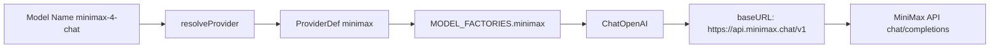
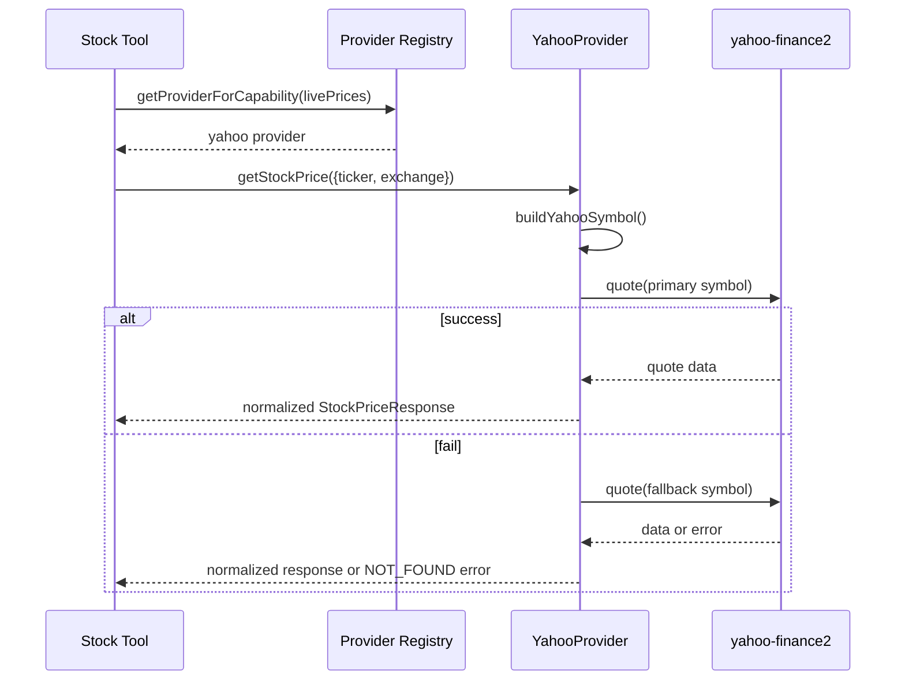

# Dexter Unified Planning Document
## MiniMax LLM + Yahoo Finance Integration (Consolidated Plan)

**Version:** 3.0 (Unified from `INTEGRATION_PLAN.md` + `MINIMAX_YAHOO_INTEGRATION.md`)  
**Created:** 2026-03-03  
**Status:** Ready for implementation

---

## 1) Requirements

### 1.1 Core Objectives

| Objective | Description | Priority |
|---|---|---|
| MiniMax LLM integration | Add MiniMax as a first-class LLM provider in Dexter | High |
| Yahoo India enhancement | Improve Yahoo provider behavior for NSE/BSE symbols | High |
| Preserve provider-agnostic architecture | Keep existing registry/factory/provider abstractions intact | High |
| Free-source-first market data | Ensure usable paths with Yahoo Finance (no paid key required) | High |
| Zero regressions | Existing providers and tools must continue to work | High |

### 1.2 Non-Negotiable Constraints

1. **MiniMax must use OpenAI-compatible integration pattern**:
   - Base URL: `https://api.minimax.chat/v1`
   - LangChain class: `ChatOpenAI`
   - **Do not** use Anthropic patterns (`ChatAnthropic`, Anthropic-specific params).
2. **Yahoo Finance remains free/no-auth** for price + historical retrieval.
3. All changes should be additive and backward-compatible with existing providers.
4. Follow existing Dexter conventions (TypeScript strict mode, Bun tooling, provider registry pattern).

### 1.3 Scope

#### In Scope
- Add MiniMax to LLM provider registry and model factory.
- Add MiniMax env key support in `.env.example`.
- Improve Yahoo provider symbol handling for Indian exchanges (`.NS` / `.BO`) with fallback behavior.
- Add/adjust tests for provider resolution and Yahoo symbol logic.
- Validate with `bun run typecheck` and `bun test`.

#### Out of Scope (for this implementation window)
- Paid finance provider expansion (Groww/Zerodha premium workflows).
- Streaming/websocket market feeds.
- New adjacent products/features unrelated to MiniMax + Yahoo integration.

### 1.4 Success Criteria

- [ ] `resolveProvider('minimax-...')` resolves to MiniMax provider.
- [ ] MiniMax requests run through `ChatOpenAI` with MiniMax base URL.
- [ ] Yahoo provider fetches NSE/BSE symbols reliably when exchange context exists.
- [ ] Yahoo provider applies safe fallback if symbol suffix attempt fails.
- [ ] Existing providers (OpenAI, Anthropic, Google, xAI, OpenRouter, Ollama, etc.) continue unchanged.
- [ ] `bun run typecheck` passes.
- [ ] `bun test` passes.

---

## 2) Diagnosis

### 2.1 Current-State Snapshot

#### LLM Layer
- Provider registry exists in `src/providers.ts`.
- Model factories exist in `src/model/llm.ts`.
- MiniMax is not currently wired as a provider/factory.

#### Finance Layer
- Yahoo provider exists at `src/tools/finance/providers/yahoo-provider.ts`.
- It supports live/historical data and already declares `markets: ['US', 'IN', 'GLOBAL']`.
- Current Yahoo implementation uses raw ticker (`validateTicker(context.ticker)`) without exchange suffix construction.

### 2.2 Gap Analysis

| Area | Current | Desired | Gap |
|---|---|---|---|
| MiniMax provider metadata | Not present in `PROVIDERS` | Present with `id: minimax`, prefix `minimax-`, env var, fast model | Missing registry entry |
| MiniMax model factory | Not present in `MODEL_FACTORIES` | `ChatOpenAI` factory with MiniMax base URL | Missing factory mapping |
| MiniMax env docs | `MINIMAX_API_KEY` not explicitly documented in `.env.example` | Clearly documented with optional base URL override | Missing config docs |
| Yahoo Indian ticker routing | Does not build `.NS/.BO` from `exchange` | Deterministic symbol builder + fallback path | Missing symbol resolution logic |
| Reliability for IN symbols | One-shot quote/historical attempt | Primary + fallback attempt strategy | Missing fallback sequence |

### 2.3 ASCII Wireframes

#### A) MiniMax Model Resolution Flow

```text
[CLI / Agent query]
       |
       v
[getChatModel(modelName)]
       |
       v
[resolveProvider(modelName)] --prefix--> [provider: minimax]
       |
       v
[MODEL_FACTORIES.minimax]
       |
       v
[ChatOpenAI(baseURL=https://api.minimax.chat/v1)]
       |
       v
[MiniMax /chat/completions]
```

#### B) Yahoo Stock Price Resolution (Indian Symbol Path)

```text
[getStockPrice({ticker, exchange})]
        |
        v
[buildYahooSymbol]
   |                \
 exchange=NSE        exchange=BSE
   |                   |
 ticker.NS            ticker.BO
        \            /
         v          v
       [quote(primarySymbol)]
               |
      +--------+---------+
      |                  |
   success             not found
      |                  |
      v                  v
 [normalize]      [quote(fallbackSymbol)]
      |                  |
      +--------+---------+
               |
             result/error
```

### 2.4 Mermaid Diagrams





### 2.5 Risk & Mitigation Summary

| Risk | Impact | Mitigation |
|---|---|---|
| Wrong integration pattern (Anthropic instead of OpenAI-compatible) | MiniMax calls fail | Enforce `ChatOpenAI` in implementation + tests |
| Prefix mismatch (`minimax-` vs `minimax:`) | Provider resolution bugs | Standardize on `minimax-` across registry + tests |
| Over-aggressive Yahoo suffixing | US ticker regressions | Only append suffix when exchange is `NSE/BSE` or controlled fallback path |
| External API instability | flaky tests | Unit-test helper behavior; guard integration tests behind env |

---

## 3) Implementation Details

> The items below unify both previous plans, with the newer OpenAI-compatible emphasis treated as authoritative.

### 3.1 LLM Workstream

#### [LLM-01] Add MiniMax provider metadata
- **File:** `src/providers.ts`
- **Change:** add a new entry in `PROVIDERS`:
  - `id: 'minimax'`
  - `displayName: 'MiniMax'`
  - `modelPrefix: 'minimax-'`
  - `apiKeyEnvVar: 'MINIMAX_API_KEY'`
  - `fastModel: 'minimax-4-flash'`
- **Placement:** near other hosted providers (e.g., after DeepSeek).

#### [LLM-02] Add MiniMax model factory (OpenAI-compatible)
- **File:** `src/model/llm.ts`
- **Change:** add `minimax` entry in `MODEL_FACTORIES`.
- **Implementation pattern:**
  - use `new ChatOpenAI({...})`
  - `apiKey: getApiKey('MINIMAX_API_KEY')`
  - `configuration.baseURL = process.env.MINIMAX_BASE_URL ?? 'https://api.minimax.chat/v1'`
- **Guardrail:** do not introduce Anthropic-specific request shape.

#### [LLM-03] Environment documentation
- **File:** `.env.example`
- **Add:**
  - `MINIMAX_API_KEY=your-minimax-api-key`
  - optional `MINIMAX_BASE_URL` override line.
- **Note:** no real key in repo.

#### [LLM-04] Provider behavior validation
- **Tests:**
  - provider resolution test for `minimax-4-chat`
  - factory creation test confirming MiniMax path does not throw when key is present
  - optional smoke integration test (only when env key exists)

### 3.2 Yahoo Finance Workstream

#### [FIN-01] Add symbol resolution helper
- **File:** `src/tools/finance/providers/yahoo-provider.ts`
- **Add method:** `buildYahooSymbol(context: ProviderRequestContext): string`
- **Rules:**
  1. If ticker already ends with `.NS` or `.BO`, keep as-is.
  2. If `exchange === 'NSE'`, return `${ticker}.NS`.
  3. If `exchange === 'BSE'`, return `${ticker}.BO`.
  4. If exchange missing, preserve ticker by default, and rely on fallback strategy.

#### [FIN-02] Extract stock response normalization helper
- **File:** same as above
- **Add method:** `buildStockPriceResponse(originalTicker, quote)` to keep `getStockPrice` concise.

#### [FIN-03] Upgrade `getStockPrice` with primary + fallback attempts
- **File:** same as above
- **Flow:**
  1. Build primary symbol via `buildYahooSymbol`.
  2. Attempt quote.
  3. If missing/not found and symbol has `.NS/.BO`, retry without suffix.
  4. Normalize success path; otherwise throw provider `NOT_FOUND`.

#### [FIN-04] Extract historical response helper
- **File:** same as above
- **Add method:** `buildHistoricalDataResponse(originalTicker, history)`.

#### [FIN-05] Upgrade `getHistoricalData` with symbol fallback
- **File:** same as above
- **Flow:**
  1. Build primary symbol.
  2. Attempt historical fetch.
  3. If empty/not found and symbol has suffix, retry without suffix.
  4. Return normalized history or `NOT_FOUND`.

#### [FIN-06] Keep capabilities explicit
- **File:** same as above
- `markets: ['US', 'IN', 'GLOBAL']` remains explicit and tested.

### 3.3 Cross-Cutting Validation

#### [QA-01] Type and test gates
- Run:
  - `bun run typecheck`
  - `bun test`

#### [QA-02] Focused functional checks
- MiniMax:
  - verify provider resolution and model invocation wiring.
- Yahoo:
  - verify NSE query (`RELIANCE` + `NSE`) resolves correctly.
  - verify BSE query (`TCS` + `BSE`) resolves correctly.
  - verify fallback behavior on invalid/missing suffix scenario.

### 3.4 Security / Reliability Notes

- Keep API keys in `.env`, never committed.
- Add retries only where already aligned with current architecture.
- Do not log secrets.
- Preserve error typing (`ProviderErrorCode`) for consistent fallback behavior.

---

## 4) Implementation Checklist

> Tasks reference implementation IDs from Section 3.

### Phase 1 — MiniMax Provider Foundation
- [ ] **P1-T1** Implement provider metadata in `src/providers.ts` (**LLM-01**)
- [ ] **P1-T2** Implement factory wiring in `src/model/llm.ts` (**LLM-02**)
- [ ] **P1-T3** Add env docs in `.env.example` (**LLM-03**)
- [ ] **P1-T4** Add/adjust MiniMax tests (**LLM-04**)

### Phase 2 — Yahoo Indian Market Enhancements
- [ ] **P2-T1** Add `buildYahooSymbol` helper (**FIN-01**)
- [ ] **P2-T2** Add stock response helper (**FIN-02**)
- [ ] **P2-T3** Refactor `getStockPrice` with fallback attempts (**FIN-03**)
- [ ] **P2-T4** Add historical response helper (**FIN-04**)
- [ ] **P2-T5** Refactor `getHistoricalData` with fallback attempts (**FIN-05**)
- [ ] **P2-T6** Confirm/test `markets` capability declaration (**FIN-06**)

### Phase 3 — Validation and Hardening
- [ ] **P3-T1** Run `bun run typecheck` and fix issues (**QA-01**)
- [ ] **P3-T2** Run `bun test` and fix regressions (**QA-01**)
- [ ] **P3-T3** Execute focused MiniMax smoke checks (**QA-02**)
- [ ] **P3-T4** Execute focused Yahoo NSE/BSE smoke checks (**QA-02**)

### Phase 4 — Documentation and Handoff
- [ ] **P4-T1** Update implementation notes/changelog for MiniMax and Yahoo behaviors
- [ ] **P4-T2** Document known limitations and fallback semantics
- [ ] **P4-T3** Final readiness review against Section 1.4 success criteria

---

**End of Unified Plan**
